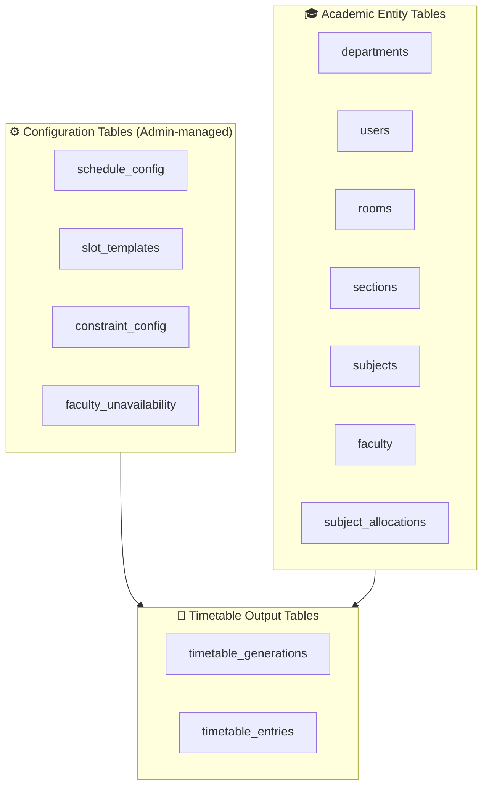

# Architecture Plan: Relational Database Schema (MySQL)
> **Revision 2 — Fully Dynamic Schema**
> All schedule structure, time boundaries, constraint weights, lab block sizes, and workload ceilings are stored in database configuration tables. Zero schema assumptions about slot count, period durations, or working days are baked into code.

---

## 1. Schema Design Philosophy

The schema is split into three logical groups:



| Group | Purpose |
|---|---|
| **Configuration** | Define *how* the schedule works — slot boundaries, active days, penalty weights, hard constraint toggles |
| **Academic Entities** | Define *what* needs to be scheduled — rooms, faculty, sections, subjects, allocations |
| **Schedule Output** | Store the generated and published timetable entries per generation run |

---

## 2. Configuration Tables (The Dynamic Layer)

### 2.1. `schedule_config`
Top-level schedule parameters per organization / academic term. Controls global flags that the solver reads at runtime.

```sql
CREATE TABLE schedule_config (
    id BIGINT AUTO_INCREMENT PRIMARY KEY,
    config_key VARCHAR(100) NOT NULL UNIQUE,
    -- Keys include:
    -- 'ACTIVE_DAYS'         → value: 'MONDAY,TUESDAY,WEDNESDAY,THURSDAY,FRIDAY'
    -- 'ACADEMIC_YEAR_START' → value: '2026-06-01'
    -- 'ACADEMIC_YEAR_END'   → value: '2026-11-30'
    -- 'SEMESTER_LABEL'      → value: 'Odd Semester 2026'
    -- 'ALLOW_SATURDAY'      → value: 'false'
    config_value TEXT NOT NULL,
    description VARCHAR(255),
    updated_by BIGINT NULL,
    updated_at TIMESTAMP DEFAULT CURRENT_TIMESTAMP ON UPDATE CURRENT_TIMESTAMP,
    FOREIGN KEY (updated_by) REFERENCES users(id) ON DELETE SET NULL
);
```

**Example Rows:**
| config_key | config_value |
|---|---|
| `ACTIVE_DAYS` | `MONDAY,TUESDAY,WEDNESDAY,THURSDAY,FRIDAY` |
| `ALLOW_SATURDAY` | `false` |
| `SEMESTER_LABEL` | `Odd Semester 2026` |

---

### 2.2. `slot_templates`
Defines every period slot — its number, exact start and end times, whether it is a break, and which days it applies to. Admins can create entirely custom schedules (e.g., 8 periods on Mon-Thu, 5 periods on Friday, break after period 4).

```sql
CREATE TABLE slot_templates (
    id BIGINT AUTO_INCREMENT PRIMARY KEY,
    slot_number INT NOT NULL,          -- Display order (1, 2, 3 ...)
    label VARCHAR(30) NOT NULL,        -- E.g., 'Period 1', 'Lunch Break', 'Lab Block A'
    start_time TIME NOT NULL,          -- E.g., '09:00:00'
    end_time TIME NOT NULL,            -- E.g., '09:55:00'
    is_break BOOLEAN DEFAULT FALSE,    -- If TRUE, solver skips this slot entirely
    applies_to_days VARCHAR(100) NOT NULL, -- Comma-separated: 'MONDAY,TUESDAY,WEDNESDAY,THURSDAY,FRIDAY'
                                           -- or 'ALL' for every active day
    is_active BOOLEAN DEFAULT TRUE,
    created_at TIMESTAMP DEFAULT CURRENT_TIMESTAMP,
    updated_at TIMESTAMP DEFAULT CURRENT_TIMESTAMP ON UPDATE CURRENT_TIMESTAMP,
    UNIQUE KEY uq_slot_number_days (slot_number, applies_to_days)
);
```

**Example Rows:**
| slot_number | label | start_time | end_time | is_break | applies_to_days |
|---|---|---|---|---|---|
| 1 | Period 1 | 09:00 | 09:55 | false | ALL |
| 2 | Period 2 | 10:00 | 10:55 | false | ALL |
| 3 | Period 3 | 11:00 | 11:55 | false | ALL |
| 4 | Short Break | 12:00 | 12:15 | true | ALL |
| 5 | Period 4 | 12:15 | 13:10 | false | ALL |
| 6 | Lunch | 13:10 | 14:00 | true | ALL |
| 7 | Period 5 | 14:00 | 14:55 | false | ALL |
| 8 | Period 6 | 15:00 | 15:55 | false | MONDAY,TUESDAY,WEDNESDAY,THURSDAY |
| 9 | Period 5F | 14:00 | 15:30 | false | FRIDAY |

> The solver only considers `is_break = false` and `is_active = true` slots as valid scheduling slots. Break rows are retained for UI display purposes only.

---

### 2.3. `constraint_config`
Stores every penalty weight and hard/soft constraint toggle. All solver behavior is driven by these rows, never by code constants.

```sql
CREATE TABLE constraint_config (
    id BIGINT AUTO_INCREMENT PRIMARY KEY,
    constraint_key VARCHAR(100) NOT NULL UNIQUE,
    -- Named constraint keys:
    -- HARD CONSTRAINTS (is_hard = true → violation = REJECT slot outright)
    -- 'HC_NO_SECTION_CLASH'          → hard: section cannot have two classes at same slot
    -- 'HC_NO_FACULTY_CLASH'          → hard: faculty cannot teach two at once
    -- 'HC_NO_ROOM_CLASH'             → hard: room cannot host two classes at once
    -- 'HC_ROOM_TYPE_MATCH'           → hard: lab subjects go to lab rooms only
    -- 'HC_ROOM_CAPACITY'             → hard: room capacity >= section student count
    -- 'HC_CONSECUTIVE_BLOCKS'        → hard: multi-slot subjects must be in consecutive slots
    -- 'HC_RESPECT_UNAVAILABILITY'    → hard: respect faculty_unavailability entries
    --
    -- SOFT CONSTRAINTS (is_hard = false → violation = add penalty_weight to cost)
    -- 'SC_FACULTY_WEEKLY_WORKLOAD'   → penalty when weekly classes exceed max_hours_per_week
    -- 'SC_FACULTY_DAILY_GAP'         → penalty per gap-hour in faculty daily schedule
    -- 'SC_STUDENT_DAILY_GAP'         → penalty per gap-hour in section daily schedule
    -- 'SC_SUBJECT_DAILY_REPEAT'      → penalty if same subject scheduled twice in one day
    -- 'SC_SUBJECT_SPREAD'            → penalty for uneven distribution across week days
    is_hard BOOLEAN NOT NULL DEFAULT FALSE,
    penalty_weight DECIMAL(8,2) DEFAULT 0.00, -- Only relevant when is_hard=false
    is_active BOOLEAN DEFAULT TRUE,
    description VARCHAR(500),
    updated_by BIGINT NULL,
    updated_at TIMESTAMP DEFAULT CURRENT_TIMESTAMP ON UPDATE CURRENT_TIMESTAMP,
    FOREIGN KEY (updated_by) REFERENCES users(id) ON DELETE SET NULL
);
```

**Example Rows:**
| constraint_key | is_hard | penalty_weight | is_active |
|---|---|---|---|
| `HC_NO_SECTION_CLASH` | true | 0 | true |
| `HC_NO_FACULTY_CLASH` | true | 0 | true |
| `HC_ROOM_CAPACITY` | true | 0 | true |
| `HC_CONSECUTIVE_BLOCKS` | true | 0 | true |
| `HC_RESPECT_UNAVAILABILITY` | true | 0 | true |
| `SC_FACULTY_WEEKLY_WORKLOAD` | false | 20.00 | true |
| `SC_FACULTY_DAILY_GAP` | false | 5.00 | true |
| `SC_STUDENT_DAILY_GAP` | false | 8.00 | true |
| `SC_SUBJECT_DAILY_REPEAT` | false | 15.00 | true |
| `SC_SUBJECT_SPREAD` | false | 10.00 | true |

---

### 2.4. `faculty_unavailability`
Stores specific slots when a faculty member is unavailable. The solver treats these as hard constraint exclusions.

```sql
CREATE TABLE faculty_unavailability (
    id BIGINT AUTO_INCREMENT PRIMARY KEY,
    faculty_id BIGINT NOT NULL,
    day_of_week VARCHAR(15) NOT NULL,   -- E.g., 'MONDAY'
    slot_template_id BIGINT NOT NULL,   -- Links to the slot_templates table
    reason VARCHAR(255),               -- E.g., 'Research Lab Duty', 'PG Classes'
    effective_from DATE,
    effective_to DATE,                 -- NULL = permanent
    created_at TIMESTAMP DEFAULT CURRENT_TIMESTAMP,
    FOREIGN KEY (faculty_id) REFERENCES faculty(id) ON DELETE CASCADE,
    FOREIGN KEY (slot_template_id) REFERENCES slot_templates(id) ON DELETE CASCADE
);
```

---

## 3. Academic Entity Tables

### 3.1. `departments`
```sql
CREATE TABLE departments (
    id BIGINT AUTO_INCREMENT PRIMARY KEY,
    name VARCHAR(100) NOT NULL UNIQUE,
    code VARCHAR(10) NOT NULL UNIQUE,
    hod_user_id BIGINT NULL,
    is_active BOOLEAN DEFAULT TRUE,
    created_at TIMESTAMP DEFAULT CURRENT_TIMESTAMP,
    updated_at TIMESTAMP DEFAULT CURRENT_TIMESTAMP ON UPDATE CURRENT_TIMESTAMP,
    FOREIGN KEY (hod_user_id) REFERENCES users(id) ON DELETE SET NULL
);
```

### 3.2. `users`
```sql
CREATE TABLE users (
    id BIGINT AUTO_INCREMENT PRIMARY KEY,
    full_name VARCHAR(100) NOT NULL,
    username VARCHAR(50) NOT NULL UNIQUE,
    email VARCHAR(100) NOT NULL UNIQUE,
    password VARCHAR(255) NOT NULL,      -- BCrypt hashed
    role ENUM('ADMIN', 'HOD', 'FACULTY', 'STUDENT') NOT NULL,
    department_id BIGINT NULL,
    is_active BOOLEAN DEFAULT TRUE,
    last_login TIMESTAMP NULL,
    created_at TIMESTAMP DEFAULT CURRENT_TIMESTAMP,
    updated_at TIMESTAMP DEFAULT CURRENT_TIMESTAMP ON UPDATE CURRENT_TIMESTAMP,
    FOREIGN KEY (department_id) REFERENCES departments(id) ON DELETE SET NULL
);
```

### 3.3. `rooms`
Room type is stored as a VARCHAR (not an ENUM) to allow organizations to define custom room types (e.g., `SEMINAR_HALL`, `DRAWING_HALL`, `WORKSHOP`) without requiring a schema change.

```sql
CREATE TABLE rooms (
    id BIGINT AUTO_INCREMENT PRIMARY KEY,
    name VARCHAR(50) NOT NULL UNIQUE,
    room_type VARCHAR(30) NOT NULL,   -- 'CLASSROOM', 'LAB', 'SEMINAR_HALL', etc. — fully dynamic
    capacity INT NOT NULL CHECK (capacity > 0),
    building VARCHAR(50),
    floor_number INT,
    is_active BOOLEAN DEFAULT TRUE,
    created_at TIMESTAMP DEFAULT CURRENT_TIMESTAMP,
    updated_at TIMESTAMP DEFAULT CURRENT_TIMESTAMP ON UPDATE CURRENT_TIMESTAMP
);
```

### 3.4. `sections`
```sql
CREATE TABLE sections (
    id BIGINT AUTO_INCREMENT PRIMARY KEY,
    name VARCHAR(20) NOT NULL,          -- 'A', 'B', 'C'
    academic_year INT NOT NULL,         -- 1, 2, 3, 4 — fully dynamic, no hardcoded max
    semester INT NOT NULL,
    student_count INT NOT NULL CHECK (student_count > 0),
    department_id BIGINT NOT NULL,
    is_active BOOLEAN DEFAULT TRUE,
    created_at TIMESTAMP DEFAULT CURRENT_TIMESTAMP,
    UNIQUE KEY uq_section (name, academic_year, semester, department_id),
    FOREIGN KEY (department_id) REFERENCES departments(id) ON DELETE CASCADE
);
```

### 3.5. `subjects`
Lab session block size (consecutive slots needed) is stored per subject in the database — never hardcoded.

```sql
CREATE TABLE subjects (
    id BIGINT AUTO_INCREMENT PRIMARY KEY,
    name VARCHAR(100) NOT NULL,
    code VARCHAR(15) NOT NULL UNIQUE,
    department_id BIGINT NOT NULL,
    semester INT NOT NULL,
    credits INT NOT NULL,
    hours_per_week INT NOT NULL,            -- Total theory/lab hours needed per week
    subject_type VARCHAR(30) NOT NULL,      -- 'THEORY', 'PRACTICAL' — extensible
    required_room_type VARCHAR(30) NOT NULL, -- Must match rooms.room_type exactly (e.g., 'LAB')
    consecutive_slots_required INT DEFAULT 1, -- Lab blocks: 2 or 3 consecutive slots (DB-defined)
    min_days_between_sessions INT DEFAULT 1,  -- Spread soft constraint: min days apart for same subject
    max_sessions_per_day INT DEFAULT 1,       -- Max times this subject can appear in one day
    created_at TIMESTAMP DEFAULT CURRENT_TIMESTAMP,
    updated_at TIMESTAMP DEFAULT CURRENT_TIMESTAMP ON UPDATE CURRENT_TIMESTAMP,
    FOREIGN KEY (department_id) REFERENCES departments(id) ON DELETE CASCADE
);
```

> **Dynamic Lab Block**: `consecutive_slots_required = 3` means the solver will search for 3 back-to-back free slots. The solver reads this per subject at runtime — no code change needed to change this value.

### 3.6. `faculty`
Workload ceiling is defined per faculty, per week, in the database. The solver reads `max_hours_per_week` at runtime.

```sql
CREATE TABLE faculty (
    id BIGINT AUTO_INCREMENT PRIMARY KEY,
    name VARCHAR(100) NOT NULL,
    employee_id VARCHAR(20) UNIQUE,
    email VARCHAR(100) NOT NULL UNIQUE,
    phone VARCHAR(15),
    department_id BIGINT NOT NULL,
    max_hours_per_week INT NOT NULL DEFAULT 18,  -- Weekly workload ceiling — fully DB-defined
    designation VARCHAR(50),                      -- 'Professor', 'Asst. Professor', etc.
    user_id BIGINT UNIQUE NULL,
    is_active BOOLEAN DEFAULT TRUE,
    created_at TIMESTAMP DEFAULT CURRENT_TIMESTAMP,
    updated_at TIMESTAMP DEFAULT CURRENT_TIMESTAMP ON UPDATE CURRENT_TIMESTAMP,
    FOREIGN KEY (department_id) REFERENCES departments(id) ON DELETE CASCADE,
    FOREIGN KEY (user_id) REFERENCES users(id) ON DELETE SET NULL
);
```

### 3.7. `subject_allocations`
Multi-faculty support: multiple rows per (subject, section) pair are allowed with different faculty IDs and allocated hours that must sum to the subject's `hours_per_week`.

```sql
CREATE TABLE subject_allocations (
    id BIGINT AUTO_INCREMENT PRIMARY KEY,
    subject_id BIGINT NOT NULL,
    section_id BIGINT NOT NULL,
    faculty_id BIGINT NOT NULL,
    allocated_hours_per_week INT NOT NULL,   -- Hours THIS faculty will deliver for this subject-section
    created_at TIMESTAMP DEFAULT CURRENT_TIMESTAMP,
    updated_at TIMESTAMP DEFAULT CURRENT_TIMESTAMP ON UPDATE CURRENT_TIMESTAMP,
    FOREIGN KEY (subject_id) REFERENCES subjects(id) ON DELETE CASCADE,
    FOREIGN KEY (section_id) REFERENCES sections(id) ON DELETE CASCADE,
    FOREIGN KEY (faculty_id) REFERENCES faculty(id) ON DELETE CASCADE
);
```

---

## 4. Timetable Output Tables

### 4.1. `timetable_generations`
Tracks each generation run (metadata, status, bottleneck logs).

```sql
CREATE TABLE timetable_generations (
    id BIGINT AUTO_INCREMENT PRIMARY KEY,
    department_id BIGINT NOT NULL,
    academic_year INT NOT NULL,
    semester INT NOT NULL,
    status ENUM('IN_PROGRESS', 'DRAFT', 'PUBLISHED', 'FAILED') DEFAULT 'IN_PROGRESS',
    triggered_by BIGINT NOT NULL,             -- User ID who triggered generation
    solver_duration_ms BIGINT,                -- How long the solver took
    bottleneck_report JSON,                   -- Stored as JSON: constraint failures, resource conflicts
    generated_at TIMESTAMP DEFAULT CURRENT_TIMESTAMP,
    published_at TIMESTAMP NULL,
    FOREIGN KEY (department_id) REFERENCES departments(id) ON DELETE CASCADE,
    FOREIGN KEY (triggered_by) REFERENCES users(id) ON DELETE CASCADE
);
```

### 4.2. `timetable_entries`
The atomic schedule records produced by the solver. Each row = one class session in the generated timetable.

```sql
CREATE TABLE timetable_entries (
    id BIGINT AUTO_INCREMENT PRIMARY KEY,
    generation_id BIGINT NOT NULL,            -- Links to the generation run
    section_id BIGINT NOT NULL,
    subject_id BIGINT NOT NULL,
    faculty_id BIGINT NOT NULL,
    room_id BIGINT NOT NULL,
    slot_template_id BIGINT NOT NULL,         -- Which slot template (not hardcoded day/time)
    day_of_week VARCHAR(15) NOT NULL,         -- 'MONDAY', 'TUESDAY', etc.
    is_manually_overridden BOOLEAN DEFAULT FALSE,
    override_reason VARCHAR(255),
    override_by BIGINT NULL,                  -- Admin/HOD who made the override
    created_at TIMESTAMP DEFAULT CURRENT_TIMESTAMP,
    updated_at TIMESTAMP DEFAULT CURRENT_TIMESTAMP ON UPDATE CURRENT_TIMESTAMP,

    -- Hard Constraint Uniqueness Guarantees (DB-enforced, no clash possible)
    UNIQUE KEY uq_room_day_slot (room_id, day_of_week, slot_template_id, generation_id),
    UNIQUE KEY uq_section_day_slot (section_id, day_of_week, slot_template_id, generation_id),
    UNIQUE KEY uq_faculty_day_slot (faculty_id, day_of_week, slot_template_id, generation_id),

    FOREIGN KEY (generation_id) REFERENCES timetable_generations(id) ON DELETE CASCADE,
    FOREIGN KEY (section_id) REFERENCES sections(id) ON DELETE CASCADE,
    FOREIGN KEY (subject_id) REFERENCES subjects(id) ON DELETE CASCADE,
    FOREIGN KEY (faculty_id) REFERENCES faculty(id) ON DELETE CASCADE,
    FOREIGN KEY (room_id) REFERENCES rooms(id) ON DELETE CASCADE,
    FOREIGN KEY (slot_template_id) REFERENCES slot_templates(id) ON DELETE CASCADE,
    FOREIGN KEY (override_by) REFERENCES users(id) ON DELETE SET NULL
);
```

> **Key design**: `slot_template_id` references the dynamic slot definition. When Admin changes a slot's time in `slot_templates`, the timetable display updates automatically for all published entries.

---

## 5. Full Entity Relationship Diagram

```mermaid
erDiagram
    schedule_config { bigint id PK; varchar config_key; text config_value }
    slot_templates { bigint id PK; int slot_number; time start_time; time end_time; boolean is_break }
    constraint_config { bigint id PK; varchar constraint_key; boolean is_hard; decimal penalty_weight }
    faculty_unavailability { bigint id PK; bigint faculty_id FK; bigint slot_template_id FK }

    departments { bigint id PK; varchar name; varchar code }
    users { bigint id PK; varchar email; varchar role; bigint department_id FK }
    rooms { bigint id PK; varchar name; varchar room_type; int capacity }
    sections { bigint id PK; varchar name; int academic_year; int semester }
    subjects { bigint id PK; varchar code; int hours_per_week; int consecutive_slots_required }
    faculty { bigint id PK; varchar name; int max_hours_per_week }
    subject_allocations { bigint id PK; bigint subject_id FK; bigint section_id FK; bigint faculty_id FK; int allocated_hours_per_week }

    timetable_generations { bigint id PK; bigint department_id FK; varchar status; json bottleneck_report }
    timetable_entries { bigint id PK; bigint generation_id FK; bigint section_id FK; bigint faculty_id FK; bigint room_id FK; bigint slot_template_id FK }

    departments ||--o{ users : has
    departments ||--o{ sections : has
    departments ||--o{ subjects : offers
    departments ||--o{ faculty : employs
    departments ||--o{ timetable_generations : generates

    sections ||--o{ subject_allocations : assigned_in
    subjects ||--o{ subject_allocations : allocated_via
    faculty ||--o{ subject_allocations : teaches_in

    slot_templates ||--o{ faculty_unavailability : blocked_in
    faculty ||--o{ faculty_unavailability : unavailable

    timetable_generations ||--o{ timetable_entries : contains
    sections ||--o{ timetable_entries : attends
    faculty ||--o{ timetable_entries : teaches
    rooms ||--o{ timetable_entries : hosts
    slot_templates ||--o{ timetable_entries : scheduled_at
```

---

## 6. Core Performance Indexes

```sql
-- Faculty personal schedule lookup
CREATE INDEX idx_entry_faculty_gen ON timetable_entries (faculty_id, generation_id);

-- Student section schedule lookup
CREATE INDEX idx_entry_section_gen ON timetable_entries (section_id, generation_id);

-- Admin department-wide schedule view
CREATE INDEX idx_entry_gen ON timetable_entries (generation_id);

-- Clash checking during solver execution (composite)
CREATE INDEX idx_clash_room ON timetable_entries (generation_id, room_id, day_of_week, slot_template_id);
CREATE INDEX idx_clash_faculty ON timetable_entries (generation_id, faculty_id, day_of_week, slot_template_id);
CREATE INDEX idx_clash_section ON timetable_entries (generation_id, section_id, day_of_week, slot_template_id);

-- Config lookups
CREATE INDEX idx_slot_active ON slot_templates (is_active, is_break);
CREATE INDEX idx_constraint_key ON constraint_config (constraint_key, is_active);
```
