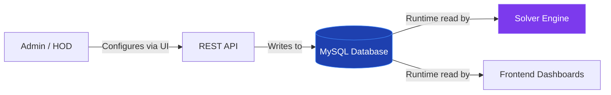
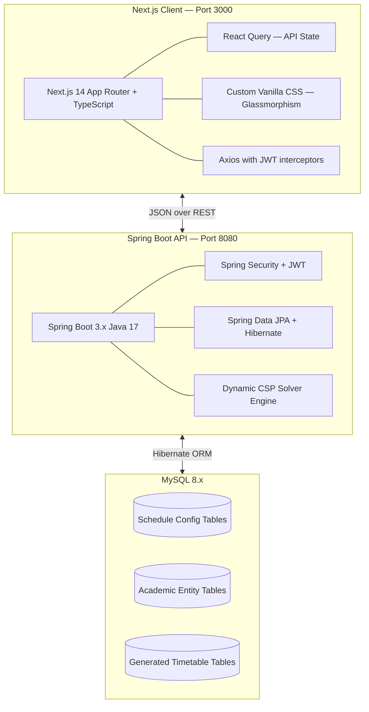
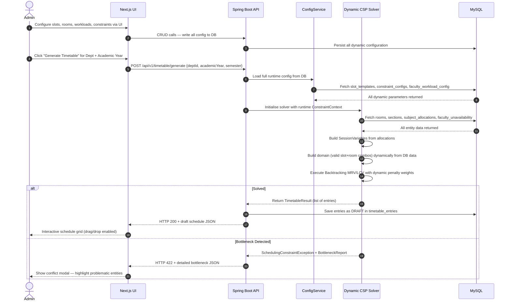
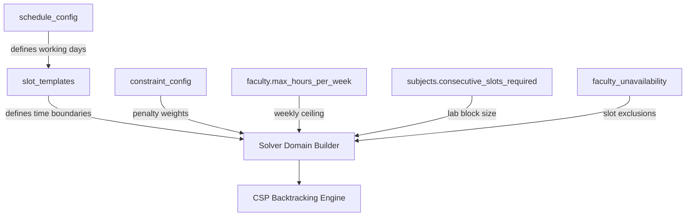
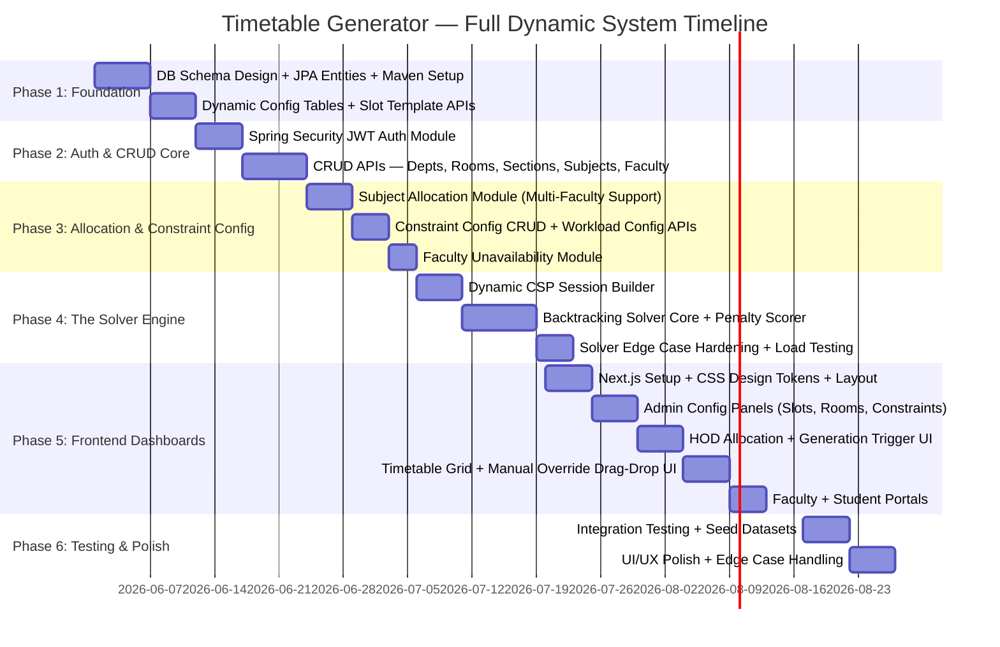

# Architecture Plan: Overview & Architecture
> **Revision 2 — Fully Dynamic System**
> All schedule structure, constraints, limits, and rules are defined and mutated exclusively through the database and REST API. Zero values are hardcoded in the application code.

---

## 1. Core Design Principle: API as Single Source of Truth

Every aspect of the scheduling system — from how many periods exist per day, to whether labs span 2 or 3 consecutive periods, to each faculty member's weekly workload ceiling — is fetched from the database at runtime. The application code contains **no hardcoded constants** for any scheduling parameter.

**What the database fully controls:**
| Category | Configurable Parameters |
|---|---|
| **Schedule Structure** | Days active per week, total slots per day, start/end times of every individual slot, which slots are breaks |
| **Rooms** | Type (Classroom / Lab / Seminar Hall / Any custom type), capacity, active status, availability windows |
| **Subjects** | Hours needed per week, whether it requires consecutive multi-slot blocks, minimum and maximum days between repetitions |
| **Faculty** | Maximum weekly teaching hours, preferred teaching days, leave/unavailability slots |
| **Constraints** | Penalty weights for every soft constraint category, hard constraint toggles per department |

---

## 2. Project Vision & Goals

The **Class Timetable Generation System** is an enterprise-grade academic planning platform that models the scheduling problem as a dynamic Constraint Satisfaction Problem (CSP) — where every constraint value, every time boundary, and every resource limit is read from the database at the time the solver is invoked.

### Key Deliverables:
- **Zero-Hardcode Guarantee**: All schedule parameters (slot count, slot times, break positions, lab block sizes, workload ceilings) are fully managed through the Admin UI and stored in the database.
- **Dynamic Constraint Engine**: The solver engine reads and respects current constraint configurations before each run. Changing a constraint in the database immediately takes effect on the next generation request.
- **Clash-Free Scheduling at Scale**: Guaranteed zero double-bookings across classrooms, labs, faculty, and sections — based entirely on runtime data.
- **Fair, Configurable Workload Balancing**: Faculty weekly workload limits are set per-faculty in the database. Penalty weights for exceeding those limits are also stored as system-level configuration, not code.
- **Role-Based Portals**:
  - **Admin**: Full system configuration, timetable generation, manual overrides with live conflict validation, audit trails.
  - **HOD**: Department-scoped configuration, faculty-to-subject mapping, generation triggers for their own department, approval workflows.
  - **Faculty**: Reads only personal allocation view, can flag preferences (preferred days, unavailable slots).
  - **Student**: Reads their section's published timetable, room and instructor details.
- **Manual Override Safety Net**: Admin/HOD can drag-and-drop or click-swap any generated slot. The backend validates the proposed change against all hard constraints before committing.

---

## 3. Technology Stack

| Layer | Technology | Rationale |
|:---|:---|:---|
| **Backend Framework** | Spring Boot 3.x (Java 17, Maven) | Powerful DI, JPA, Security, async support; Java ideal for constraint-heavy algorithmic code |
| **Database** | MySQL 8.x | ACID, FK constraints, JSON column support for flexible constraint configs, window functions for workload queries |
| **ORM** | Spring Data JPA + Hibernate | Eliminates SQL boilerplate; manages complex entity graphs (Allocations, Entries, Configs) |
| **Security** | Spring Security + JJWT | Stateless JWT; role-scoped endpoint protection; token refresh support |
| **Frontend** | Next.js 14 (App Router, TypeScript) | SSR for public-facing pages, CSR for dashboards, built-in route protection via middleware |
| **Styling** | Custom Vanilla CSS | Maximum theme control; glassmorphic dark palette; no utility-class lock-in |
| **API Layer** | React Query + Axios | Automatic caching, background refetching, mutation state for generation flows |

---

## 4. High-Level Architecture & Generation Flow

---

## 5. Dynamic Configuration Architecture

The system introduces a **Schedule Configuration** subsystem — a set of database tables that define the rules, not the application code.

**Configuration Tables Summary:**
1. **`schedule_config`** — Master toggle: active days per week (stored as comma-separated day names), global academic calendar settings per semester.
2. **`slot_templates`** — Every period slot definition (slot number, start time, end time, is_break, applies_to_days). Fully managed by Admin.
3. **`constraint_config`** — Named penalty weights and hard/soft flags per constraint type: `FACULTY_GAP_PENALTY`, `STUDENT_GAP_PENALTY`, `SUBJECT_REPEAT_PENALTY`, etc. Each stored as a configurable float.
4. **`faculty_unavailability`** — Faculty-specific slot blocks (e.g., "Prof X unavailable Monday Slot 1-3 for research"). Treated as a hard constraint by the solver.

---

## 6. Project Duration & Milestones (10 Weeks)

### Phase Overview:

| Phase | Duration | Focus |
|---|---|---|
| **1 — Foundation** | Week 1–2 | DB schema, JPA setup, dynamic slot template system |
| **2 — Auth & CRUD** | Week 3–4 | JWT security, all entity CRUD APIs |
| **3 — Allocation & Config** | Week 4–5 | Multi-faculty allocations, constraint config, unavailability |
| **4 — Solver Engine** | Week 5–7 | Dynamic CSP builder, backtracking solver, scoring, load tests |
| **5 — Frontend** | Week 7–9 | All 4 role portals, config panels, schedule grid, override UI |
| **6 — QA & Polish** | Week 9–10 | Seed data tests, constraint scenario validation, UI refinement |
