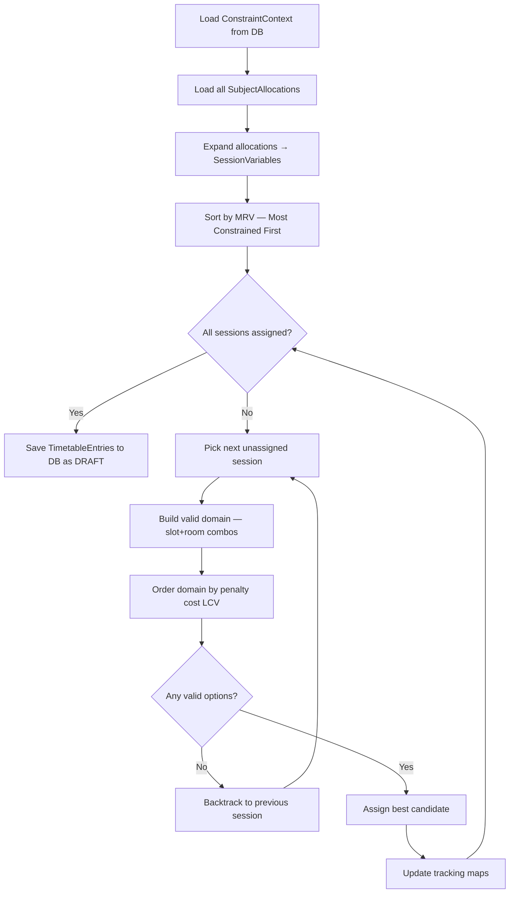

# Architecture Plan: Timetable Generation Algorithm
> **Revision 2 — Fully Dynamic Constraint Engine**
> No constraint values, slot counts, lab durations, workload ceilings, or penalty weights are defined in code. All parameters are loaded from the database into a `ConstraintContext` object before the solver begins.

---

## 1. Core Design: The `ConstraintContext` (Runtime Configuration Object)

Before the solver executes a single assignment, the `TimetableService` builds a complete `ConstraintContext` object by querying the configuration tables. This object is the **sole source of truth** during the solver run.

```java
/**
 * Immutable runtime container populated from DB config tables.
 * The Solver Engine reads ONLY from this context — never from application.yml or constants.
 */
@Value  // Lombok immutable value class
public class ConstraintContext {

    // From slot_templates table
    List<SlotTemplate> activeSchedulingSlots;   // Only is_break=false, is_active=true rows
    Map<String, List<SlotTemplate>> slotsByDay; // Pre-grouped by day_of_week

    // From schedule_config table
    List<String> activeDays;                    // e.g., ['MONDAY','TUESDAY','WEDNESDAY','THURSDAY','FRIDAY']

    // From constraint_config table
    Map<String, Boolean> hardConstraintFlags;   // e.g., {'HC_NO_SECTION_CLASH': true}
    Map<String, Double> softPenaltyWeights;     // e.g., {'SC_FACULTY_DAILY_GAP': 5.0}

    // From faculty_unavailability table (pre-loaded per faculty)
    Map<Long, Set<String>> facultyBlockedSlots; // facultyId → Set of "MONDAY_slotTemplateId"

    // From faculty table (per-faculty weekly ceiling)
    Map<Long, Integer> facultyWeeklyMaxHours;   // facultyId → max_hours_per_week

    // From subjects table (per-subject structural config)
    Map<Long, Integer> subjectConsecutiveSlots; // subjectId → consecutive_slots_required
    Map<Long, Integer> subjectMaxPerDay;         // subjectId → max_sessions_per_day
    Map<Long, Integer> subjectMinDayGap;         // subjectId → min_days_between_sessions
    Map<Long, String>  subjectRequiredRoomType;  // subjectId → required_room_type ('LAB','CLASSROOM',...)
}
```

The solver engine constructor signature:
```java
public TimetableSolver(
    ConstraintContext ctx,           // All rules from DB — zero code constants
    List<SessionVariable> variables, // Built from subject_allocations
    List<Room> rooms,                // From rooms table
    TimetableEntryRepository repo    // For in-progress clash checking
) { ... }
```

---

## 2. Problem Formulation (Dynamic CSP Model)

### 2.1. Variables — Built Dynamically from Allocations

Each `SubjectAllocation` row (one faculty's share of a subject for a section) is expanded into **N independent SessionVariables**, where N = `allocated_hours_per_week / consecutive_slots_required`.

```
SubjectAllocation:
  subject = "Computer Networks" (hours_per_week=4, consecutive_slots_required=1, required_room_type='CLASSROOM')
  section = "CSE-2B"
  faculty = "Prof. Anand"
  allocated_hours_per_week = 4

→ Expands to 4 SessionVariables:
   [CN, Prof.Anand, CSE-2B, blockSize=1, roomType=CLASSROOM]  × 4

SubjectAllocation:
  subject = "OS Lab" (hours_per_week=3, consecutive_slots_required=3, required_room_type='LAB')
  section = "CSE-2B"
  faculty = "Prof. Maya"
  allocated_hours_per_week = 3

→ Expands to 1 SessionVariable:
   [OS Lab, Prof.Maya, CSE-2B, blockSize=3, roomType=LAB]  × 1
```

The `blockSize` is read from `subjects.consecutive_slots_required` — fully database-defined.

### 2.2. Domain — Built Dynamically from Slot Templates

For each `SessionVariable`, the solver computes a domain of candidate `Assignment` objects:

```
Assignment = (day_of_week, start_slot_template_id, room_id)
```

Domain computation for a session with `blockSize = 3`:
1. Fetch all active, non-break `slot_templates` for each `activeDays` day.
2. Group slots by day, sort by `slot_number`.
3. For each day, find all starting positions where `blockSize` consecutive slots exist (i.e., slots at positions i, i+1, i+2 are consecutive and non-break).
4. Filter by:
   - Room type matches `subjectRequiredRoomType` for this session.
   - Room capacity ≥ section `student_count`.
   - Faculty is not blocked in any of the `blockSize` slots (check `facultyBlockedSlots` from `faculty_unavailability`).

> **This makes lab block duration fully dynamic.** If a DBA changes `consecutive_slots_required` from 3 to 2 for a subject, the solver automatically computes 2-slot blocks on the next run.

---

## 3. Hard & Soft Constraints — Fully Database-Driven

### 3.1. Hard Constraints (Read from `constraint_config.is_hard = true`)

| DB Key | Enforcement Logic |
|---|---|
| `HC_NO_SECTION_CLASH` | Reject assignment if `section_id + day + slot` already assigned in current generation |
| `HC_NO_FACULTY_CLASH` | Reject assignment if `faculty_id + day + slot` already assigned |
| `HC_NO_ROOM_CLASH` | Reject assignment if `room_id + day + slot` already assigned |
| `HC_ROOM_TYPE_MATCH` | Reject if `room.room_type != session.requiredRoomType` |
| `HC_ROOM_CAPACITY` | Reject if `room.capacity < section.student_count` |
| `HC_CONSECUTIVE_BLOCKS` | Reject if `blockSize > 1` and all `blockSize` consecutive slots are not free |
| `HC_RESPECT_UNAVAILABILITY` | Reject if faculty has an unavailability record for this day+slot |

An Admin can **toggle individual hard constraints off** by setting `is_active = false` in `constraint_config`. For example, disabling `HC_ROOM_TYPE_MATCH` would allow theory subjects to use lab rooms if no classrooms are available (useful as a last resort for very-constrained scenarios).

### 3.2. Soft Constraints — Penalty-Weighted Optimization

All penalty weights come from `constraint_config.penalty_weight`. The solver computes a `totalCost` for each candidate assignment:

```
totalCost(assignment) = Σ [ activeConstraint.penalty_weight × violationCount(constraint, assignment) ]
```

| DB Key | When Penalty Applied | Violation Count |
|---|---|---|
| `SC_FACULTY_WEEKLY_WORKLOAD` | When `currentWeeklySlots(faculty) > max_hours_per_week` | Excess slot count |
| `SC_FACULTY_DAILY_GAP` | When faculty has non-teaching slots between teaching slots in a day | Gap slot count |
| `SC_STUDENT_DAILY_GAP` | When section has idle slots between class slots in a day | Gap slot count |
| `SC_SUBJECT_DAILY_REPEAT` | When same subject appears > `max_sessions_per_day` times in a day | Excess count |
| `SC_SUBJECT_SPREAD` | When subject sessions are not evenly spread across the week | Imbalance score |

**Example Dynamic Penalty Calculation:**

```java
private double calculatePenalty(SessionVariable session, CandidateAssignment candidate, ConstraintContext ctx) {
    double cost = 0.0;

    // SC_FACULTY_WEEKLY_WORKLOAD — weight from DB
    double workloadPenaltyWeight = ctx.getSoftPenaltyWeights().getOrDefault("SC_FACULTY_WEEKLY_WORKLOAD", 0.0);
    if (workloadPenaltyWeight > 0) {
        int currentWeeklySlots = assignedWeeklySlots(session.getFacultyId());
        int maxWeeklySlots = ctx.getFacultyWeeklyMaxHours().get(session.getFacultyId());
        int excessSlots = Math.max(0, (currentWeeklySlots + session.getBlockSize()) - maxWeeklySlots);
        cost += excessSlots * workloadPenaltyWeight;
    }

    // SC_FACULTY_DAILY_GAP — weight from DB
    double gapPenaltyWeight = ctx.getSoftPenaltyWeights().getOrDefault("SC_FACULTY_DAILY_GAP", 0.0);
    if (gapPenaltyWeight > 0) {
        int gapSlots = calculateGapsIfAssigned(session.getFacultyId(), candidate.getDay(), candidate.getSlotNumber());
        cost += gapSlots * gapPenaltyWeight;
    }

    // SC_SUBJECT_DAILY_REPEAT — weight from DB
    double repeatPenaltyWeight = ctx.getSoftPenaltyWeights().getOrDefault("SC_SUBJECT_DAILY_REPEAT", 0.0);
    if (repeatPenaltyWeight > 0) {
        int maxPerDay = ctx.getSubjectMaxPerDay().get(session.getSubjectId());
        int currentSameDayCount = countSameDayAssignments(session.getSubjectId(), session.getSectionId(), candidate.getDay());
        if (currentSameDayCount >= maxPerDay) {
            cost += repeatPenaltyWeight; // Flat penalty for exceeding daily max
        }
    }

    // SC_SUBJECT_SPREAD — weight from DB
    double spreadPenaltyWeight = ctx.getSoftPenaltyWeights().getOrDefault("SC_SUBJECT_SPREAD", 0.0);
    if (spreadPenaltyWeight > 0) {
        cost += calculateSpreadPenalty(session, candidate, ctx) * spreadPenaltyWeight;
    }

    return cost;
}
```

---

## 4. Workload Balancing — Weekly, Database-Driven

### 4.1. How Weekly Workload is Enforced

The solver tracks each faculty's assigned slots in a running in-memory map during backtracking:

```java
Map<Long, Integer> facultyAssignedSlotsThisWeek = new HashMap<>();
// key = faculty_id, value = total assigned slot count so far in this generation run
```

At every candidate evaluation:
1. Read `maxHours = ctx.getFacultyWeeklyMaxHours().get(facultyId)` — from DB, per faculty.
2. Compute `projectedTotal = currentTotal + blockSize`.
3. If `projectedTotal > maxHours`, apply `SC_FACULTY_WEEKLY_WORKLOAD` penalty.
4. The solver naturally picks lower-cost options first (via LCV ordering), distributing load evenly.

> No daily class count limit exists in code. The only ceiling is `max_hours_per_week` set in the `faculty` table. Admins can change this per faculty at any time without code changes.

### 4.2. Multi-Faculty Workload Splitting

```
Subject: "Data Structures"  → hours_per_week = 5
Section: "IT-3A"

Allocations:
  Prof. Rajan  → allocated_hours_per_week = 3  (Theory classes)
  Prof. Meena  → allocated_hours_per_week = 2  (Tutorial sessions)

Generated SessionVariables:
  [DS, Prof.Rajan, IT-3A, block=1, room=CLASSROOM]  × 3
  [DS, Prof.Meena, IT-3A, block=1, room=CLASSROOM]  × 2
```

Prof. Rajan and Prof. Meena's weekly totals are tracked **independently**. When the solver assigns Prof. Rajan's DS sessions, Prof. Meena's counter is unaffected. Both faculty's `max_hours_per_week` thresholds are enforced separately.

---

## 5. The Solver Engine: Backtracking CSP with MRV + LCV

### 5.1. Full Solver Flow



### 5.2. MRV Ordering (Most Constrained Variable First)

Variables are sorted before search begins. Priority order (descending):

1. **Lab/Multi-slot sessions first** — higher `consecutive_slots_required` = scheduled first (most constrained).
2. **Subjects with `min_days_between_sessions > 1`** next (spread constraint makes fewer days available).
3. **Faculty with fewer available slots** (after subtracting `faculty_unavailability` blocks) next.
4. **Sections with most subjects** (least scheduling flexibility) next.
5. **Single-period theory sessions** scheduled last (most flexible, most domain options).

```java
public class VariableMRVComparator implements Comparator<SessionVariable> {
    private final ConstraintContext ctx;

    @Override
    public int compare(SessionVariable a, SessionVariable b) {
        // Primary: bigger block size = higher priority
        int blockDiff = Integer.compare(
            ctx.getSubjectConsecutiveSlots().get(b.getSubjectId()),
            ctx.getSubjectConsecutiveSlots().get(a.getSubjectId())
        );
        if (blockDiff != 0) return blockDiff;

        // Secondary: larger min_day_gap = higher priority (more constrained)
        int gapDiff = Integer.compare(
            ctx.getSubjectMinDayGap().get(b.getSubjectId()),
            ctx.getSubjectMinDayGap().get(a.getSubjectId())
        );
        if (gapDiff != 0) return gapDiff;

        // Tertiary: faculty with fewer available weekly slots = higher priority
        int aAvailable = computeAvailableSlots(a.getFacultyId(), ctx);
        int bAvailable = computeAvailableSlots(b.getFacultyId(), ctx);
        return Integer.compare(aAvailable, bAvailable);
    }
}
```

### 5.3. Bottleneck Detection & Reporting

When backtracking completely exhausts all options, the solver does NOT just fail silently. It generates a structured `BottleneckReport` stored as JSON in `timetable_generations.bottleneck_report`:

```json
{
  "type": "UNSOLVABLE",
  "bottlenecks": [
    {
      "category": "RESOURCE_SHORTAGE",
      "entity_type": "ROOM",
      "entity_ids": [3, 5],
      "description": "Only 2 LAB rooms available (capacity ≥ 60) for 4 sections requiring simultaneous lab sessions on WEDNESDAY."
    },
    {
      "category": "WORKLOAD_OVERFLOW",
      "entity_type": "FACULTY",
      "entity_ids": [12],
      "description": "Prof. Suresh has 22 allocated hours but max_hours_per_week = 18. 4 hours cannot be scheduled."
    }
  ],
  "suggested_actions": [
    "Add 2 more LAB rooms with capacity ≥ 60",
    "Reduce Prof. Suresh's allocations by 4 hours or increase max_hours_per_week to 22"
  ]
}
```

This JSON is returned in the API response body with `HTTP 422 Unprocessable Entity`.

---

## 6. Constraint Validation for Manual Overrides

When Admin/HOD performs a manual slot swap, the backend runs a **targeted constraint validation** (not a full solve) to check if the proposed override violates any active hard constraints:

```java
public OverrideValidationResult validateSwap(
    Long entryId,             // Entry being moved
    String newDay,            // Target day
    Long newSlotTemplateId,   // Target slot
    Long newRoomId,           // Target room (may be same or different)
    ConstraintContext ctx
) {
    List<String> violations = new ArrayList<>();

    // Check all active hard constraints from DB
    if (ctx.getHardConstraintFlags().getOrDefault("HC_NO_ROOM_CLASH", true)) {
        if (isRoomOccupied(newRoomId, newDay, newSlotTemplateId, entryId)) {
            violations.add("Room " + newRoomId + " is already occupied on " + newDay + " Slot " + newSlotTemplateId);
        }
    }
    if (ctx.getHardConstraintFlags().getOrDefault("HC_NO_FACULTY_CLASH", true)) {
        if (isFacultyOccupied(entry.getFacultyId(), newDay, newSlotTemplateId, entryId)) {
            violations.add("Faculty " + entry.getFacultyId() + " is already teaching on " + newDay);
        }
    }
    if (ctx.getHardConstraintFlags().getOrDefault("HC_RESPECT_UNAVAILABILITY", true)) {
        if (isFacultyUnavailable(entry.getFacultyId(), newDay, newSlotTemplateId, ctx)) {
            violations.add("Faculty has a registered unavailability block at this slot.");
        }
    }
    // ... all other active HC checks

    if (violations.isEmpty()) {
        return OverrideValidationResult.valid();
    }
    return OverrideValidationResult.invalid(violations);
}
```
